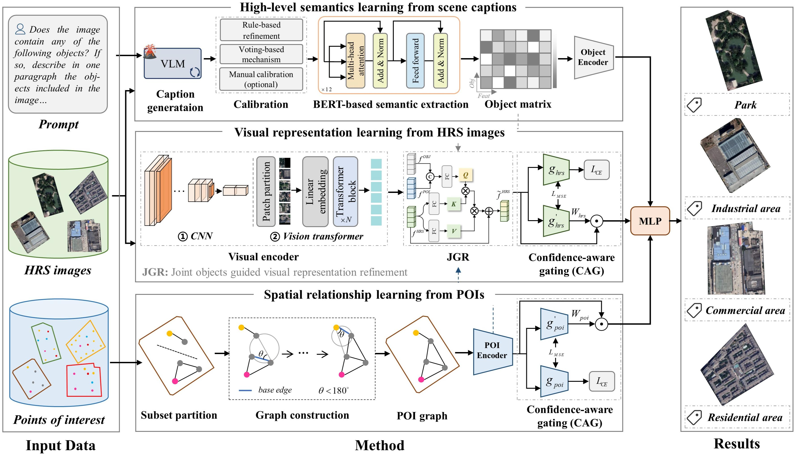
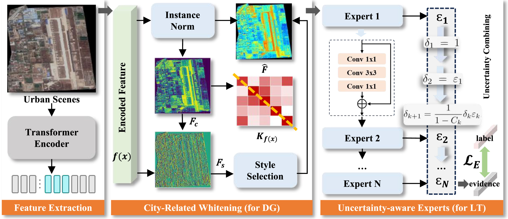
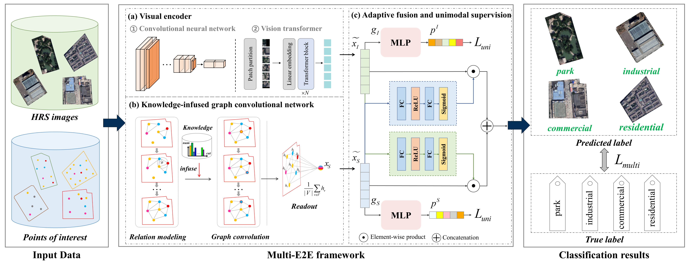
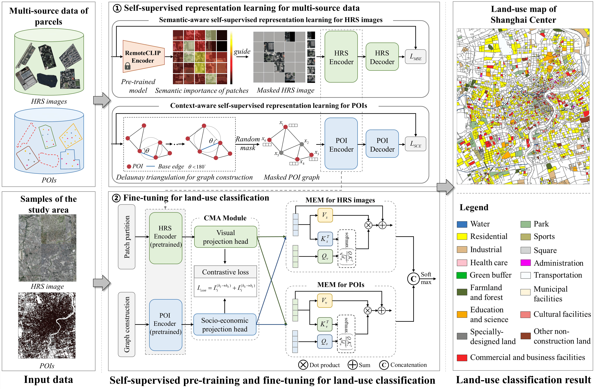
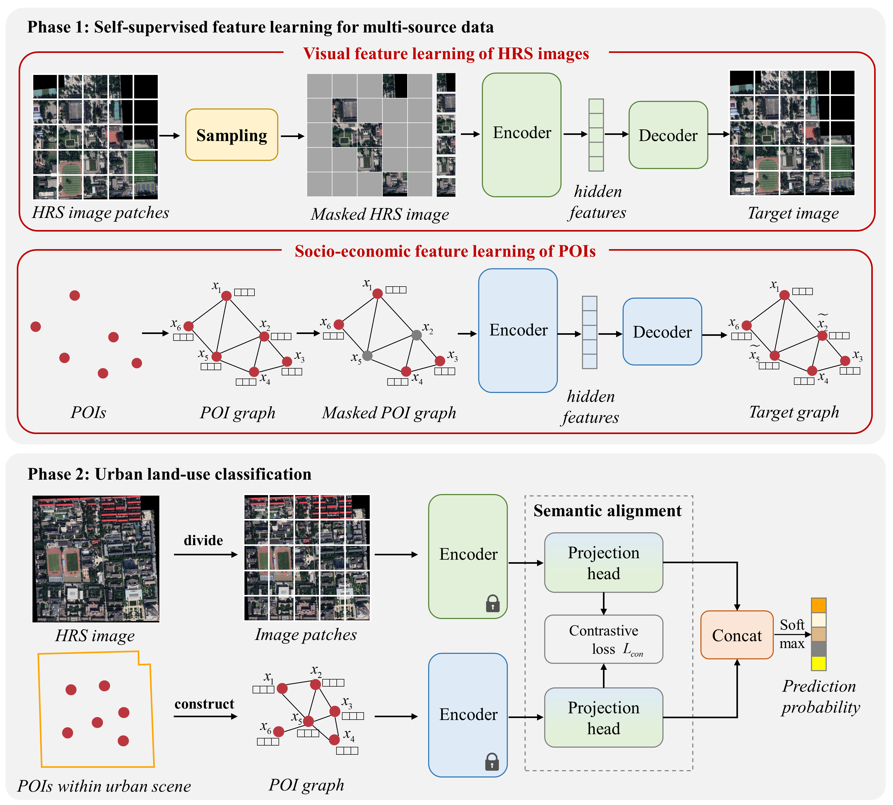
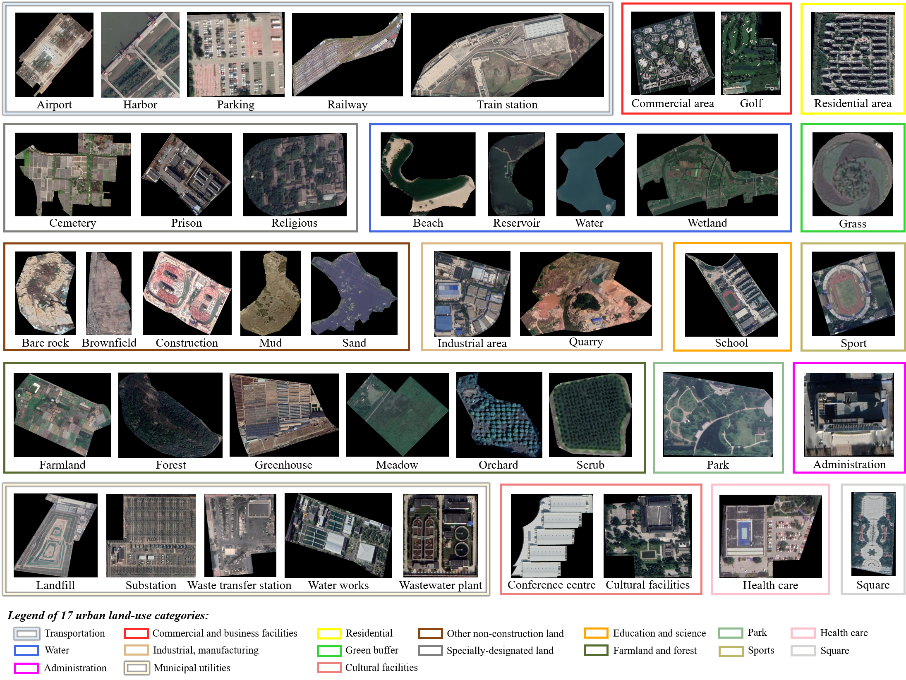

Ruiyi Yang received the B.S. degree from the School of Remote Sensing and Information Engineering, Wuhan University, in 2023. She is currently pursuing the Ph.D. degree in the State Key Laboratory of Information Engineering in Surveying, Mapping and Remote Sensing, Wuhan University, advised by <u>Prof. Yanfei Zhong</u>. Her research interests include multi-source data driven urban land-use mapping and high-resolution urban scene understanding. 

# 🔥 News
- *2026.04*: &nbsp;🎉🎉 One paper is accepted by ISPRS (IF=12.2)!
- *2025.09*: &nbsp;🎉🎉 One co-authored paper is accepted by ISPRS (IF=12.2)!
- *2025.08*: &nbsp;🎉🎉 One paper is accepted by RSE (IF=11.4)! 
- *2024.12*: &nbsp;🎉🎉 One paper is accepted by IEEE TGRS (IF=8.6)!
- *2024.05*: &nbsp;🎉🎉 One paper is accepted by IGARSS 2024 (Oral)! 
- *2023.08*: &nbsp;🎉🎉 One co-authored paper is accepted by RSE (IF=11.4)!

# 📝 Publications 

ISPRS 2026

Large vision-language model knowledge guided multi-source urban land-use mapping: A case study of representative cities across six continents

[**Code**](https://github.com/Rayoll/VLM-LU)

**Ruiyi Yang**, Yu Su, Yinhe Liu, Ailong Ma, Yanfei Zhong

- This paper proposes a large vision-language model knowledge-guided multi-source feature learning framework for urban land-use mapping (VLM-LU). The VLM-LU performs well on cities across six continents, demonstrating its potential practicality in large-scale land-use mapping.
  

  

ISPRS 2025

[Global urban high-resolution scene classification via uncertainty-aware domain generalization](https://www.sciencedirect.com/science/article/pii/S0924271625003387)

Jingjun Yi, Yanfei Zhong, Yu Su, **Ruiyi Yang**, Yinhe Liu, Junjue Wang

- To address two key challenges in global urban scene classification: cross-city style differences and long-tailed data distribution, this paper proposes a uncertainty-aware domain generalization (UADG) framework. The UADG enhances robustness and classification performance under cross-city settings.
  

  

RSE 2025

[Multi-E2E: An end-to-end urban land-use mapping framework integrating high-resolution remote sensing images and multi-source geographical data](https://www.sciencedirect.com/science/article/pii/S0034425725003700)

**Ruiyi Yang**, Yu Su, Yanfei Zhong

[**Code**](https://github.com/Rayoll/Multi_E2E) 

- This work proposes an end-to-end urban land-use mapping framework integrating high-resolution remote sensing images and multi-source geographic data (Multi-E2E). The Multi-E2E framework automatically establishes the mapping from multi-source data to land-use categories through a data-driven approach.
  

  

TGRS 2024

[Self-supervised joint representation learning for urban land-use classification with multisource geographic data](https://ieeexplore.ieee.org/abstract/document/10855160/)

**Ruiyi Yang**, Yu Su, Yanfei Zhong

- This paper introduces a self-supervised joint representation learning (SJRL) framework for urban land-use classification with multisource geographic data. For the high-resolution remote sensing images, a semantic-aware self-supervised representation approach is employed to mine the significant visual information of the HRS images. For the points of interest (POIs), a context-aware self-supervised representation learning approach is designed to investigate the spatial distribution patterns of POIs.
  

  

IGARSS 2024

[Urban land-use classification with multi-source self-supervised representation learning and correlation modeling](https://ieeexplore.ieee.org/document/10642159)

**Ruiyi Yang**, Yu Su, Yanfei Zhong

- This work proposes an urban land-use classification framework with multi-source self-supervised representation learning and correlation modeling (LUSC). This framework introduces self-supervised approaches for HRS images and POIs to mine the multi-source representations from parcels.
  

  

RSE 2023

[Global urban high-resolution land-use mapping: From benchmarks to multi-megacity applications](https://www.sciencedirect.com/science/article/pii/S0034425723003097)

Yanfei Zhong, Bowen Yan, Jingjun Yi, **Ruiyi Yang**, Mengzi Xu, Yu Su, Zhendong Zheng, Liangpei Zhang

[**Dataset**](https://rsidea.whu.edu.cn/GUN_dataset.htm)

- A large-scale fine-grained urban land-use dataset GlobalUrbanNet (GUN) and a multi-city fully automatic urban land-use mapping method (AutoULUM) are developed, boosting the coordinated development of multiple cities around the world.
  

  

# 🎖 Honors and Awards
- *2026.01* Chen Yongling Academician Outstanding Student Science and Technology Innovation Scholarship（陈永龄院士优秀学生科技创新奖学金）
- *2025.11* China Graduate Smart City Technology and Creative Design Competition, 1st prize（中国研究生智慧城市技术与创意设计大赛一等奖）
- *2024.10* Outstanding graduate academic second-class scholarship, Wuhan University（武汉大学优秀研究生学术二等奖学金）
- *2023.10* Outstanding Graduate Freshman First-class Scholarship, Wuhan University（武汉大学优秀研究生新生一等奖学金）
- *2022.12* National Scholarship for Undergraduate Student（本科生国家奖学金）

# 📖 Educations
- *2023.09 - now*, Doctoral, Wuhan University, Wuhan.
- *2019.09 - 2023.06*, Bachelor, Wuhan University, Wuhan.

